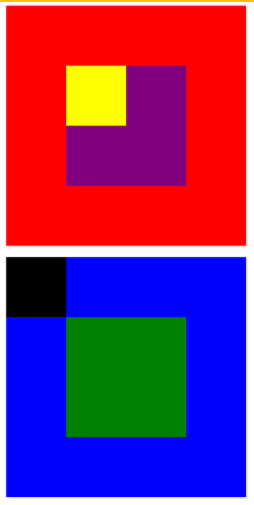

# **Posicionando Cajas**
---
- ### **Objetivo**
Replicar cajas poniendo en práctica lo aprendido sobre ***positioning***.

- ### **Contenido**
Consta de dos cajas (padres) que a su vez contienen otras más pequeñas (hijas). Esto se logró aplicando el valor _position relative_ a las cajas padres y el valor _position absolute_ a las hijas, además de otros valores y unidades necesarios.

 #### Resultado:

